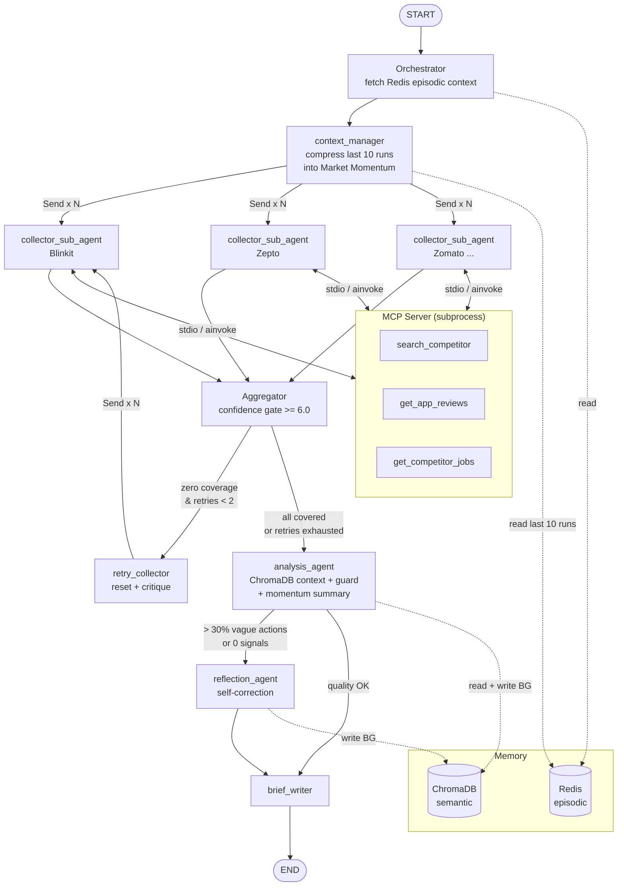

# CompeteIQ

CompeteIQ is an autonomous competitive intelligence agent for **SwiftMart**, a quick-commerce company competing with Blinkit, Zepto, Zomato, Amazon Fresh, and Instamart in Indian metro markets. It runs a fully automated pipeline: parallel competitor signal collection via MCP-served tools, confidence-gated aggregation, LLM-powered analysis with hallucination guards and market momentum context, self-correction via a reflection loop, and an executive intelligence brief. Every run is traced with LangSmith, timed at the node level, and stored in Redis (episodic memory) and ChromaDB (semantic memory) so future runs benefit from historical context.

---

## Architecture



**Node summary**

| Node | Role |
|---|---|
| `orchestrator` | Seeds the run, pulls last-5-run summary from Redis |
| `context_manager` | Pulls last 10 runs from Redis, calls LLM to distil a Market Momentum summary injected into collector and analysis prompts |
| `collector_sub_agent` | One per competitor (parallel via `Send()`); fetches 3 tools concurrently from MCP server via `asyncio.gather()` + `ainvoke()` |
| `aggregator` | Merges parallel results, drops signals below confidence 6.0, tracks zero-coverage |
| `retry_collector` | Increments retry counter, resets signals, injects critique for deeper search (max 2 retries) |
| `analysis_agent` | Classifies signals (THREAT/OPPORTUNITY/NEUTRAL), applies hallucination guard, writes ChromaDB in background |
| `reflection_agent` | Re-runs analysis with targeted critique when > 30% of actions are vague or 0 signals produced (max 1 pass) |
| `brief_writer` | Formats final executive brief in structured markdown |

---

## Tech Stack

| Component | Technology |
|---|---|
| Orchestration | LangGraph 1.x (`StateGraph`, `Send()` fan-out) |
| LLM | Groq `llama-3.3-70b-versatile` via `langchain-groq` |
| Tool serving | FastMCP server (`skills/mcp_server.py`) + `langchain-mcp-adapters` client |
| Web search | Tavily (`langchain-tavily`) with tenacity retry (3x, exp backoff) |
| App reviews | `google-play-scraper` |
| Job signals | Adzuna Jobs API |
| Episodic memory | Redis (LPUSH/LRANGE run history) |
| Semantic memory | ChromaDB (`PersistentClient`, cosine similarity) |
| Context engineering | Market Momentum summary (LLM-compressed last 10 runs) + weighted decay scoring |
| Tracing | LangSmith (`@traceable`) + custom `traced_node` (per-node ms) |
| Cost tracking | Token usage from `response_metadata`; Groq pricing ($0.59/1M in, $0.79/1M out) |
| Scheduling | APScheduler `AsyncIOScheduler` (`--schedule` flag, every 6 hours) |
| Evals | DeepEval GEval with `GroqJudge` (custom `DeepEvalBaseLLM`) |
| Simulation | `SimulationHarness` — adversarial signal injection + golden case generation |
| Package manager | `uv` |

---

## Setup

### 1. Install dependencies

```bash
uv sync
```

### 2. Configure environment

Copy `.env.example` to `.env` and fill in your keys:

```env
GROQ_API_KEY=gsk_...
TAVILY_API_KEY=tvly-...
ADZUNA_APP_ID=your_id
ADZUNA_APP_KEY=your_key
LANGCHAIN_API_KEY=ls__...        # optional — enables LangSmith tracing
LANGCHAIN_TRACING_V2=true        # optional
REDIS_URL=redis://localhost:6379  # optional — skipped gracefully if unavailable
```

**Required:** `GROQ_API_KEY`, `TAVILY_API_KEY`
**Optional:** `ADZUNA_APP_ID` + `ADZUNA_APP_KEY` (job signals degrade gracefully without them), `LANGCHAIN_API_KEY` (tracing), `REDIS_URL` (episodic memory + context_manager)

### 3. Start Redis (optional)

```bash
docker run -d -p 6379:6379 redis:7-alpine
```

ChromaDB persists locally to `./chroma_db/` automatically.

---

## Running

### Single live run

```bash
uv run python main.py
```

### Scheduled run (every 6 hours, fires immediately on startup)

```bash
uv run python main.py --schedule
```

### MCP server (standalone, for debugging tool calls)

```bash
python -m skills.mcp_server
```

The MCP server is normally launched automatically as a subprocess by `skills/mcp_client.py`. Run it manually only to inspect tool behaviour in isolation.

### Integration tests (replay harness — no live API calls)

```bash
uv run pytest tests/test_graph_replay.py -v
```

### Simulation tests (adversarial + reflection logic — no LLM calls)

```bash
uv run pytest tests/test_simulation.py -v
```

### Eval suite (GEval quality metrics against golden dataset)

```bash
uv run pytest tests/test_evals.py -v
```

### Full test suite

```bash
uv run pytest tests/ -v
```

> **Rate limits:** The free Groq tier is 12,000 TPM / 100,000 TPD. Integration and eval tests use module-scoped fixtures so the graph runs exactly once per `pytest` session. Simulation tests make no LLM calls. Run LLM-backed suites on separate days if you hit the daily limit.

---

## Sample Output

```
Starting CompeteIQ monitoring run... [LLM: Groq llama-3.3-70b-versatile]

============================================================
## CompeteIQ Intelligence Brief
**Run ID:** a3f7c2b1 | **Competitors:** ['zomato', 'blinkit']

### HIGH PRIORITY (Impact 8-10)
- **Blinkit Zero-Fee Delhi** (Impact 9): Blinkit cut delivery fees to Rs0 on
  orders >= Rs99 across Delhi. SwiftMart's Rs25 base fee is now uncompetitive
  in our 67%-share market. Launch a 30-day fee waiver campaign immediately.

### MEDIUM PRIORITY (Impact 5-7)
- **Zomato ML Hiring** (Impact 6): 15 ML engineer roles targeting ETA
  prediction — signals a push to close Zomato's speed gap with quick-commerce.
  Monitor delivery SLA changes over the next 90 days.

### OPPORTUNITIES
- **Zepto App Degradation** (Impact 7): Zepto Bangalore rating dropped 4.2->3.5
  with 500+ 1-star reviews. Targeted SwiftMart push notifications to lapsed
  Zepto users in Bangalore could capture churned customers this week.

### Summary
- Signals detected: 4
- Threats: 1 | Opportunities: 2 | Neutral: 1
- Most urgent action: Launch Delhi delivery-fee match within 48 hours
============================================================

Signals collected : 4
Signals analyzed  : 4
Tool calls made   : 6
Retry count       : 0
Total latency     : 6842ms

Per-node latencies:
  collector_sub_agent            4201ms
  context_manager                 843ms
  analysis_agent                 1893ms
  orchestrator                    512ms
  brief_writer                    236ms
  aggregator                        1ms

Token usage:
  Input tokens    : 8,412
  Output tokens   : 1,204
  Estimated cost  : $0.0059 USD

Run logged to data/run_log.jsonl
Run saved to episodic memory (Redis)
```

---

## Project Structure

```
competitor-analysis/
  agents/
    llm.py              # Groq-only LLM singleton
    schema.py           # RawSignal / AnalyzedSignal Pydantic models
    state.py            # CompeteIQState TypedDict with custom reducers
  data/
    mock_signals.json   # 4 realistic mock signals for offline testing
    run_log.py          # Append-only JSONL logger
  evals/
    golden_dataset.json     # 4 hand-labeled test cases
    groq_judge.py           # DeepEvalBaseLLM wrapper using Groq
    metrics.py              # AssessmentCorrectness + ReasoningQuality GEval metrics
  graph/
    workflow.py         # 9 nodes + 4 edge functions (full pipeline)
  harness/
    replay.py           # Deterministic test harness (patches live tools with fixtures)
    simulation.py       # Adversarial signal injection + golden case generation
  memory/
    context_manager.py  # get_last_n_runs, compress_to_momentum_summary, apply_weighted_decay
    episodic.py         # Redis run history store
    semantic.py         # ChromaDB signal store
  prompts/
    constants.py        # All system prompt strings
  skills/
    mcp_server.py       # FastMCP server exposing 3 tools over MCP protocol
    mcp_client.py       # MCP client (lazy-init subprocess, falls back to direct tools)
    tools.py            # Tool implementations with tenacity retry
  tests/
    test_graph_replay.py    # 7 integration tests (module-scoped fixture)
    test_simulation.py      # 10 simulation / reflection-routing tests (no LLM)
    test_evals.py           # 6 eval tests + regression gate (threshold 0.6)
  utils/
    guard.py            # Hallucination guard (competitor + assessment validation)
    observability.py    # traced_node decorator + compute_run_metrics (with cost)
  config.py             # Env vars + constants
  main.py               # Async entrypoint; --schedule flag for 6-hour APScheduler loop
```
